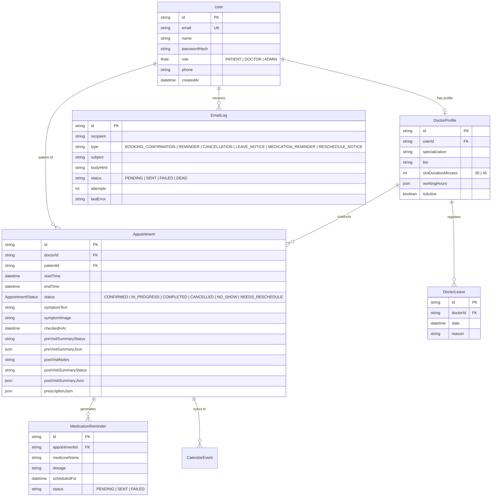

# 🏥 MedTrack Pro — Next-Gen Clinical Scheduling & Healthcare Operations Platform

**MedTrack Pro** is a comprehensive, production-grade clinical scheduling and healthcare operations suite engineered with **Next.js 15 App Router**, **TypeScript**, **PostgreSQL (Prisma ORM)**, **Auth.js v5 (Google OAuth 2.0 & Credentials)**, **Google Gemini AI (2.5 Flash)**, **Pusher Channels**, **Upstash Redis/QStash**, **Resend/Brevo SMTP**, and **Google Calendar 2-Way Sync**.

The platform unifies patient booking, concurrent double-booking exclusion, pre-visit AI diagnostic triage, real-time waiting room queues, post-visit structured prescription care plans, 1-click care plan PDF exports, background medication adherence reminders, practice analytics, and role-based authentication.

- **🌐 Live Production Deployment**: [https://med-pro-one.vercel.app](https://med-pro-one.vercel.app)
- **💻 GitHub Source Repository**: [https://github.com/aryaman0406/MedPro](https://github.com/aryaman0406/MedPro)

---

## 🔑 Demo Accounts & Access Credentials

| Portal / Role | Email Address | Password | Capabilities & Direct 1-Click Sign-In Link |
|---|---|---|---|
| 👑 **Admin Portal** | `admin@medtrack.pro` | `AdminPass123!` | Clinic administration, doctor creation & working hours, leave blackout dates, practice analytics & email retry queue $\rightarrow$ [Log in as Admin](https://med-pro-one.vercel.app/login?role=ADMIN) |
| 🩺 **Doctor Portal** | `sarah.jenkins@medtrack.pro` | `DoctorPass123!` | Cardiology specialist (9:00–17:00), AI pre-visit intake summaries, real-time Pusher waiting room, post-visit notes & prescription builder $\rightarrow$ [Log in as Doctor](https://med-pro-one.vercel.app/login?role=DOCTOR) |
| 🩺 **Doctor Portal** | `marcus.chen@medtrack.pro` | `DoctorPass123!` | Neurology specialist (8:00–16:00), schedule & leave management $\rightarrow$ [Log in as Doctor](https://med-pro-one.vercel.app/login?role=DOCTOR) |
| 🩺 **Doctor Portal** | `priya.patel@medtrack.pro` | `DoctorPass123!` | Pediatrics specialist (10:00–18:00), schedule & leave management $\rightarrow$ [Log in as Doctor](https://med-pro-one.vercel.app/login?role=DOCTOR) |
| 👤 **Patient Portal** | `john.doe@example.com` | `PatientPass123!` | Doctor search with 1-click filter chips, slot selection with 5-min holds, symptom & photo intake, real-time queue tracker & medication schedule $\rightarrow$ [Log in as Patient](https://med-pro-one.vercel.app/login?role=PATIENT) |

> *Note: Clicking any portal link above opens [`/login`](https://med-pro-one.vercel.app/login) directly activated on that specific portal tab (`Admin`, `Doctor`, or `Patient`).*

---

## 🌟 Standout Capabilities & Architecture Highlights

1. **Role-Differentiated Sign-In & Google OAuth 2.0**:
   - **Explicit Portal Tabs**: Interactive tabs for **Patient**, **Doctor**, and **Admin** on the sign-in window.
   - **Google OAuth ("Continue with Google")**: Prominently available for Patients. For existing registered Doctor or Admin Google accounts, verified email matching links directly to their account preserving their role intact.
   - **Clean Credentials Form**: Role-specific header guidance and secure password visibility toggles (`Eye` / `EyeOff`).

2. **Light Mode Default & Deep Teal Theme**:
   - Application defaults to **Light Mode** out of the box for optimal readability, with full dark mode toggle support.
   - Palette built around **Deep Teal** (`#0F766E`), **Mint Teal** (`#14B8A6`), **Warm Amber** (`#F59E0B`), and **Rose Urgency Badges**.

3. **Pre-Visit Clinical Intake & AI Synthesis (Google Gemini 2.5 Flash)**:
   - Evaluates verbatim patient symptoms at booking.
   - Extracts clinical urgency (*Low* / *Medium* / *High*), chief complaint, and three tailored diagnostic exploration questions for the physician.
   - Awaited synchronously during booking confirmation to guarantee immediate availability on doctor dashboards.
   - Includes a 1-click **⚡ Generate AI Summary Now** button for manual re-synthesis.

4. **📸 Patient Symptom Photo / Attachment Upload**:
   - Allows patients to attach symptom photos, skin lesions, or lab reports during intake booking.
   - Preserves attachment preview thumbnails on both patient and doctor consultation detail dashboards.

5. **🖨️ 1-Click Isolated Care Plan PDF Exporter**:
   - Provides a 1-click **"Print Care Plan PDF"** button on patient and doctor consultation pages.
   - Features targeted CSS `@media print` rules that isolate the selected appointment card into a clean, 1-page formal medical report while automatically suppressing non-printable navigation bars, headers, and footers.

6. **Post-Visit Patient Brief & Care Plan Generation**:
   - Converts doctor's clinical encounter notes and structured prescriptions (`medicineName`, `dosage`, `frequencyPerDay`, `durationDays`) into warm, patient-friendly plain summaries.
   - Generates structured medication schedules and follow-up action items stored in `postVisitSummaryJson`.

7. **Real-Time Clinical Queue & Patient Position Tracker (Pusher Channels)**:
   - 30-minute pre-visit physical check-in window.
   - Live FIFO waiting room ordered strictly by check-in timestamp (`checkedInAt asc`) on the doctor's portal.
   - Instant *"Call Next Patient"* broadcast transitioning patients to `IN_PROGRESS` and updating the patient's screen (*"You are #N in queue"*) with zero browser refreshes.

8. **Multi-Party Google Calendar 2-Way Sync**:
   - 1-Click **`📅 Add to Google Calendar`** buttons across Booking Confirmation, Patient Appointments, Doctor Schedule, and Doctor Encounter Detail pages.
   - Pre-populates exact appointment start/end times, doctor name, patient name, clinic location, and clinical symptoms.

9. **Double-Booking Exclusion & Redis Hold Locks**:
   - PostgreSQL GiST exclusion constraint (`prisma/migrations/20260821_add_appointment_exclusion_constraint`) preventing overlapping active appointments.
   - Atomic 5-minute Upstash Redis slot hold locks (`SET NX EX 300`) while patients enter symptoms.

10. **Automated Medication Reminders & Dead Letter Queue**:
    - Upstash QStash 15-minute background cron worker scanning pending reminders and sending adherence emails via Brevo/Nodemailer HTML templates.
    - Automated retry worker for failed emails with an interactive Dead Letter Queue dashboard on `/admin`.

11. **Doctor Leave Management & Admin Patient Reassignment**:
    - When doctors apply for leave, any overlapping patient appointments (including 1-month advance bookings) automatically transition to `NEEDS_RESCHEDULE`.
    - Admin Portal features a dedicated **Doctor Leaves & Blackout Roster** and an interactive **Patient Reassignment & Reschedule Dialog**.
    - Admins can reassign patients to another active doctor or reschedule with the same doctor (restricted to **1 day earlier or 1 day after** per clinic policy).

12. **Dedicated Reschedule Notification Emails**:
    - When an admin reassigns a patient's appointment, any pending "Reschedule Required" leave notice emails are automatically superseded.
    - A dedicated **Reschedule Notice Email** (`EmailType.RESCHEDULE_NOTICE`) with an updated consultation summary card is immediately delivered to both the patient and the assigned doctor.

---

## 📊 Database Schema & Entity Relationship Overview



---

## 🚀 Quickstart & Local Setup Guide

Follow these steps to run MedTrack Pro locally in under 5 minutes:

### 1. Clone & Install Dependencies
```bash
git clone https://github.com/aryaman0406/MedPro.git
cd MedPro
npm install
```

### 2. Configure Environment Variables
Copy the template to `.env.local`:
```bash
cp .env.example .env.local
```

Populate environment variables using your free service keys (*Note: Zero real secrets are committed to Git*):

| Variable | Purpose | Where to Get Free Key |
|---|---|---|
| `DATABASE_URL` | PostgreSQL connection string | [Supabase](https://supabase.com/) or [Neon](https://neon.tech/) (Free PostgreSQL) |
| `AUTH_SECRET` | 32-char encryption secret for Auth.js | Run `npx auth secret` or `openssl rand -base64 32` |
| `NEXTAUTH_URL` | Application base URL | `http://localhost:3000` |
| `GOOGLE_CLIENT_ID` | Google OAuth 2.0 Web Client ID | [Google Cloud Console](https://console.cloud.google.com/) |
| `GOOGLE_CLIENT_SECRET` | Google OAuth 2.0 Client Secret | [Google Cloud Console](https://console.cloud.google.com/) |
| `GEMINI_API_KEY` | Google Gemini 2.5 Flash AI client | [Google AI Studio](https://aistudio.google.com/) (Free) |
| `UPSTASH_REDIS_REST_URL` | Redis REST endpoint for 5-min slot holds | [Upstash Redis Console](https://console.upstash.com/redis) |
| `UPSTASH_REDIS_REST_TOKEN` | Redis REST authentication token | [Upstash Redis Console](https://console.upstash.com/redis) |
| `QSTASH_CURRENT_SIGNING_KEY` | Background cron verification key | [Upstash QStash Console](https://console.upstash.com/qstash) |
| `BREVO_SMTP_HOST` | Transactional email relay host | `smtp.resend.com` / `smtp-relay.brevo.com` |
| `BREVO_SMTP_PORT` | Transactional email port | `465` / `587` |
| `BREVO_SMTP_USER` | SMTP login account | [Resend](https://resend.com) or [Brevo](https://brevo.com) |
| `BREVO_SMTP_KEY` | SMTP API / Master key | [Resend](https://resend.com) or [Brevo](https://brevo.com) |
| `PUSHER_APP_ID` / `PUSHER_KEY` | Real-time queue WebSocket credentials | [Pusher Dashboard](https://dashboard.pusher.com/) |
| `NEXT_PUBLIC_PUSHER_KEY` | Client-side Pusher key | Same as `PUSHER_KEY` |

### 3. Initialize Database & Seed Data
```bash
# Push schema to PostgreSQL
npm run db:push

# Seed database with active specialists, patients, and 30-day historical analytics data
npm run db:seed
```

### 4. Start Development Server
```bash
npm run dev
```
Open [http://localhost:3000](http://localhost:3000) in your browser.

---

## 🧪 Automated Testing Suite & Verification

MedTrack Pro includes a full automated unit and integration test suite powered by **Vitest**:

```bash
# Run unit and integration tests
npm run test

# Run TypeScript type check
npx tsc --noEmit

# Run ESLint check
npm run lint
```

---

## 🌐 Submission Links & Deployment

- **Live Production URL**: [https://med-pro-one.vercel.app](https://med-pro-one.vercel.app)
- **GitHub Source Repository**: [https://github.com/aryaman0406/MedPro](https://github.com/aryaman0406/MedPro)
