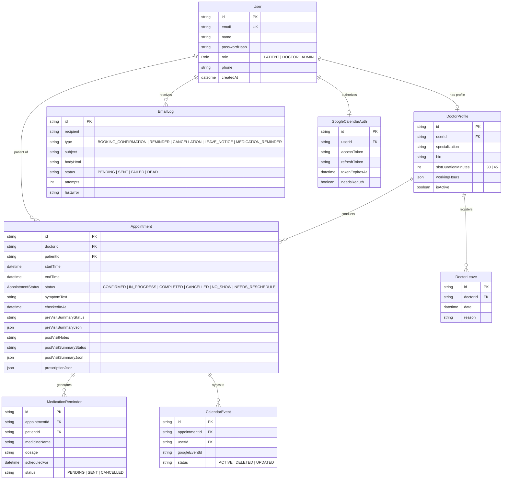

# 🏥 MedTrack Pro — Next-Gen Clinical Scheduling & Healthcare Operations Platform

**MedTrack Pro** is a comprehensive, production-grade clinical scheduling and operations suite engineered with **Next.js 15 App Router**, **TypeScript**, **PostgreSQL (Prisma ORM)**, **Google Gemini AI (2.5 Flash)**, **Pusher Channels**, **Upstash Redis/QStash**, **Nodemailer (Brevo SMTP)**, and **Google Calendar OAuth 2.0**.

The platform unifies patient booking, concurrent double-booking exclusion, pre-visit AI diagnostic triage, real-time waiting room queues, post-visit structured prescription care plans, background medication adherence reminders, and practice analytics.

---

## 🌟 Standout Capabilities & Architecture Highlights

1. **Pre-Visit Clinical Intake & AI Synthesis (Google Gemini 2.5 Flash)**:
   - Evaluates verbatim patient symptoms at booking.
   - Extracts clinical urgency (*Low* / *Medium* / *High*), chief complaint, and three tailored diagnostic exploration questions for the physician.
   - Zero-crash fallback architecture with single retry and non-blocking asynchronous execution.

2. **Real-Time Clinical Queue & Patient Position Tracker (Pusher Channels)**:
   - 30-minute pre-visit physical check-in window.
   - Live FIFO waiting room ordered strictly by check-in timestamp (`checkedInAt asc`) on the doctor's portal.
   - Instant *"Call Next Patient"* broadcast transitioning patients to `IN_PROGRESS` and updating the patient's screen (*"You are #N in queue"*) with zero browser refreshes.

3. **Multi-Party Google Calendar Sync (Google OAuth 2.0)**:
   - Incremental OAuth 2.0 flow scoped to `https://www.googleapis.com/auth/calendar.events`.
   - Automatically synchronizes tailored events to both the patient's and doctor's personal Google Calendars on booking confirmation.
   - Seamlessly removes or updates Google Calendar events on cancellations or rescheduling.

4. **Structured Prescription Builder & Automated Medication Reminders**:
   - Doctor encounter form supporting clinical notes and repeatable structured prescription rows (`medicineName`, `dosage`, `frequencyPerDay`, `durationDays`, `instructions`).
   - Converts doctor's notes into patient-friendly plain summaries, medication schedules, and follow-up guidance via Gemini.
   - Automated 15-minute background cron worker (Upstash QStash) dispatching personalized branded medication adherence emails.

5. **Leave Conflict Triage & Passwordless Magic-Link Rescheduling**:
   - Doctor leave creation scans and flags overlapping bookings as `NEEDS_RESCHEDULE`.
   - Generates a 7-day cryptographically signed JWT magic link (`jose`).
   - Patients click to access a public passwordless `/reschedule/[token]` portal with an interactive slot navigator to atomically swap their booking.

6. **Practice Analytics & Operations Dashboard (Recharts)**:
   - 30-Day consultation volume bar chart stacked by status (Completed, Scheduled, No-Show, Cancelled).
   - Doctor weekly capacity utilization progress bars derived dynamically from working hours minus active leave days.
   - 8-Week historical patient no-show rate area trend ($\frac{\text{NO\_SHOW}}{\text{COMPLETED} + \text{NO\_SHOW}} \times 100$).
   - Integrated email delivery health dashboard with dead-letter queue inspection and one-click manual retry.

---

## 🚀 Quickstart & Local Setup Guide

Follow these steps to run MedTrack Pro locally in under 5 minutes:

### 1. Clone & Install Dependencies
```bash
git clone https://github.com/aryaman0406/MedPro.git
cd MedPro
npm install
```

### 2. Configure Environment Variables
Copy the template to `.env.local` or `.env`:
```bash
cp .env.example .env.local
```

Populate the required environment variables. Every single integration runs on **free-tier accounts with no credit card required**:

| Variable | Purpose | Where to Get Free Key |
|---|---|---|
| `DATABASE_URL` | PostgreSQL connection string | [Supabase](https://supabase.com/) or [Neon](https://neon.tech/) (Free PostgreSQL) |
| `AUTH_SECRET` | 32-char encryption secret for Auth.js | Run `npx auth secret` or `openssl rand -base64 32` |
| `NEXTAUTH_URL` | Application base URL | `http://localhost:3000` |
| `GEMINI_API_KEY` | Google Gemini 2.5 Flash AI client | [Google AI Studio](https://aistudio.google.com/) (Free, no card) |
| `UPSTASH_REDIS_REST_URL` | Redis REST endpoint for 5-min slot holds | [Upstash Redis Console](https://console.upstash.com/redis) (Free serverless Redis) |
| `UPSTASH_REDIS_REST_TOKEN` | Redis REST authentication token | [Upstash Redis Console](https://console.upstash.com/redis) |
| `QSTASH_CURRENT_SIGNING_KEY` | Background cron verification key | [Upstash QStash Console](https://console.upstash.com/qstash) (Free 500 msgs/day) |
| `BREVO_SMTP_HOST` | Transactional email relay host | `smtp-relay.brevo.com` |
| `BREVO_SMTP_PORT` | Transactional email port | `587` |
| `BREVO_SMTP_USER` | Brevo login email | [Brevo Dashboard](https://app.brevo.com/settings/keys/smtp) (Free 300 emails/day) |
| `BREVO_SMTP_KEY` | Brevo SMTP master key | [Brevo Dashboard](https://app.brevo.com/settings/keys/smtp) |
| `GOOGLE_CLIENT_ID` | Google OAuth 2.0 Web Client ID | [Google Cloud Console](https://console.cloud.google.com/) (Testing mode) |
| `GOOGLE_CLIENT_SECRET` | Google OAuth 2.0 Client Secret | [Google Cloud Console](https://console.cloud.google.com/) |
| `GOOGLE_CALENDAR_REDIRECT_URI` | OAuth 2.0 callback endpoint | `http://localhost:3000/api/auth/google-calendar/callback` |
| `PUSHER_APP_ID` / `PUSHER_KEY` | Real-time queue WebSocket credentials | [Pusher Dashboard](https://dashboard.pusher.com/) (Free Sandbox: 200k msgs/day) |
| `NEXT_PUBLIC_PUSHER_KEY` | Client-side Pusher key | Same as `PUSHER_KEY` |

> *Note: If external API keys (such as Brevo, Google OAuth, Pusher, or Gemini) are not provided, the platform automatically activates graceful fallbacks (e.g. mock console logs, offline queue polling, and default summary fallbacks) so the application remains 100% testable.*

### 3. Initialize Database & Seed Rich Demo Data
```bash
# Push schema to PostgreSQL
npm run db:push

# Seed database with doctors, patients, and 30-day historical analytics data
npm run db:seed
```

### 4. Start Development Server
```bash
npm run dev
```
Open [http://localhost:3000](http://localhost:3000) in your browser.

---

## 🔑 Pre-Seeded Evaluator Accounts (1-Click Demo)

The login screen (`/login`) includes **1-Click Demo Fill** buttons to switch roles instantly:

| Role | Email | Password | What You Can Test |
|---|---|---|---|
| **Admin** | `admin@medtrack.pro` | `AdminPass123!` | Practice analytics charts, doctor roster management, email delivery DLQ retry |
| **Doctor** | `sarah.jenkins@medtrack.pro` | `DoctorPass123!` | Live FIFO queue, intake briefs, "Complete Visit" clinical notes & Rx builder, "Mark No-Show" |
| **Patient** | `john.doe@example.com` | `PatientPass123!` | Booking wizard with pulsing 5-min timer ring, live queue position tracker, Care Plans, Google Calendar sync |

---

## 📊 Database Schema & Entity Relationship Overview



---

## 🤖 LLM Prompts & Enforced JSON Contracts

### 1. Pre-Visit Diagnostic Triage Prompt
- **Trigger**: Upon booking confirmation.
- **Model**: `gemini-2.5-flash` via `@google/genai`.
- **System Instruction**:
```text
Analyse these symptoms and return: urgency level (Low / Medium / High), chief complaint, and three suggested questions for the doctor. Symptoms: <symptoms>
```
- **Strict JSON Output Schema**:
```json
{
  "urgency": "Low" | "Medium" | "High",
  "chiefComplaint": "string",
  "suggestedQuestions": [
    "string",
    "string",
    "string"
  ]
}
```

### 2. Post-Visit Patient Brief & Care Plan Prompt
- **Trigger**: Upon doctor completing clinical encounter.
- **Model**: `gemini-2.5-flash`.
- **System Instruction**:
```text
Convert these clinical notes into a patient-friendly summary with medication schedule and follow-up steps: <notes + structured prescription>
```
- **Strict JSON Output Schema**:
```json
{
  "plainSummary": "string",
  "medicationSchedule": [
    {
      "medicine": "string",
      "whenToTake": "string",
      "durationDays": 30
    }
  ],
  "followUpSteps": [
    "string"
  ]
}
```

---

## 🔌 API Route Handlers & Server Actions Reference

### Server Actions
| Action | File | Access | Description |
|---|---|---|---|
| `loginUserAction(data)` | `src/app/actions/auth.ts` | Public | Authenticates credentials with bcrypt and issues JWT session. |
| `registerUserAction(data)` | `src/app/actions/auth.ts` | Public | Creates Patient or Doctor account with validated fields. |
| `getDoctorSlotsAction(doctorId, date)` | `src/app/actions/booking.ts` | Public | Generates real-time slot grid subtracting bookings, leaves, and active holds. |
| `holdSlotAction(input)` | `src/app/actions/booking.ts` | Patient | Places 300-second atomic Redis reservation lock (`SET NX EX 300`). |
| `confirmBookingAction(input)` | `src/app/actions/booking.ts` | Patient | Atomic database insert with exclusion check, calendar sync, and email queuing. |
| `completeDoctorVisitAction(input)` | `src/app/actions/doctor.ts` | Doctor/Admin | Saves clinical notes & prescriptions, schedules reminders, triggers AI synthesis. |
| `markAppointmentNoShowAction(id)` | `src/app/actions/doctor.ts` | Doctor/Admin | Triumphs past un-checked-in consultations to `NO_SHOW` feeding analytics. |
| `requestDoctorLeaveAction(input)` | `src/app/actions/doctor.ts` | Doctor/Admin | Creates blackout date and transitions overlapping bookings to `NEEDS_RESCHEDULE`. |
| `patientCheckInAction(id)` | `src/app/actions/queue.ts` | Patient | Checks in within 30 min of start time and broadcasts to Pusher channel. |
| `doctorCallNextPatientAction(id)` | `src/app/actions/queue.ts` | Doctor | Transitions waiting patient to `IN_PROGRESS` and broadcasts live position update. |
| `getAdminAnalyticsAction()` | `src/app/actions/admin.ts` | Admin | Computes 30-day volume, doctor capacity utilization %, and 8-week no-show trend. |
| `rescheduleAppointmentWithTokenAction(data)`| `src/app/actions/reschedule.ts` | Public (Token) | Atomically swaps booking using 7-day signed JWT magic link. |

### API Route Handlers
| Route | Method | Purpose | Authentication |
|---|---|---|---|
| `/api/auth/google-calendar/connect` | `GET` | Initiates incremental OAuth 2.0 consent flow | Session Auth |
| `/api/auth/google-calendar/callback` | `GET` | Exchanges auth code for refresh token and stores encrypted at rest | Session Auth |
| `/api/jobs/process-email-queue` | `POST` | Processes pending email logs with Brevo SMTP and backoff retries | QStash Signature / Bearer |
| `/api/jobs/send-due-reminders` | `POST` | Queries due medication reminders and queues reminder emails | QStash Signature / Bearer |

---

## 📅 Google Calendar OAuth 2.0 Setup Guide

1. Go to the [Google Cloud Console](https://console.cloud.google.com/).
2. Create a new project named `MedTrack Pro`.
3. Navigate to **APIs & Services > Library**, search for **Google Calendar API**, and click **Enable**.
4. Navigate to **OAuth consent screen**:
   - User Type: **External**.
   - App Name: `MedTrack Pro`.
   - Add Scope: `https://www.googleapis.com/auth/calendar.events`.
   - Publishing Status: **Testing** (add your evaluation Gmail as a Test User).
5. Navigate to **Credentials > Create Credentials > OAuth client ID**:
   - Application Type: **Web application**.
   - Authorized redirect URIs: `http://localhost:3000/api/auth/google-calendar/callback`.
6. Copy the **Client ID** and **Client Secret** into your `.env.local`:
   ```env
   GOOGLE_CLIENT_ID="your-client-id.apps.googleusercontent.com"
   GOOGLE_CLIENT_SECRET="your-client-secret"
   GOOGLE_CALENDAR_REDIRECT_URI="http://localhost:3000/api/auth/google-calendar/callback"
   ```

---

## 🧪 Automated Testing Suite

MedTrack Pro includes an automated test suite powered by **Vitest**:

```bash
# Run all unit and integration tests
npm run test
```

### Test Suite Coverage
1. **`test/unit/slot-availability.test.ts`**:
   - Verifies mathematical boundary slot generation (16 slots for 8-hour shift, 12 slots for 6-hour Friday shift).
   - Weekend off-duty detection (`isOffDuty=true`).
   - Doctor leave date blackout subtraction (`isOnLeave=true`).
   - Booked appointment subtraction and Redis user hold status mapping.
2. **`test/unit/gemini-validation.test.ts`**:
   - Validates `PreVisitSummarySchema` urgency enums (*Low* / *Medium* / *High*), chief complaints, and diagnostic question arrays.
   - Rejects malformed JSON and verifies regex markdown code-fence cleaner.
   - Validates `PostVisitSummarySchema` and `PrescriptionItemSchema` coercion rules.
3. **`test/integration/concurrency-booking.test.ts`**:
   - Simulates 10 concurrent requests for the exact same slot timestamp.
   - Asserts **strictly 1 successful booking** and **9 rejected double-booking conflict errors**.

---

## 🌐 Live Production Deployment & Known Limitations

- **Live Production URL**: [https://medpro-sable.vercel.app](https://medpro-sable.vercel.app)
- **GitHub Repository**: [https://github.com/aryaman0406/MedPro](https://github.com/aryaman0406/MedPro)

### Known Limitations of the Free-Tier Deployment
When evaluating the live free-tier production deployment, keep the following platform constraints in mind:

1. **Google OAuth Consent Screen (Testing Mode)**:
   - Google restricts OAuth consent in *Testing* status to a maximum of 100 explicitly invited test user Gmail accounts. For broader deployment, the GCP project would need to be verified or placed in *Production* consent status.
2. **Brevo SMTP Outbound Rate Limit**:
   - The free Brevo SMTP relay account has a cap of **300 transactional emails/day** with a maximum sending rate of 5 emails/second.
3. **Upstash Serverless Free Quotas**:
   - **Upstash Redis**: Free tier permits up to 10,000 commands/day and 256MB memory.
   - **Upstash QStash**: Free background cron dispatch allows up to 500 messages/day.
4. **Pusher Channels Sandbox Plan**:
   - The Pusher Sandbox cluster is limited to 200,000 WebSocket messages/day and 100 concurrent browser connections.
5. **Vercel Serverless Function Execution Limits**:
   - Vercel Hobby plan enforces a 10-second maximum duration per serverless function invocation. Long-running AI batch synthesis operations are therefore decoupled asynchronously to avoid function timeouts.
6. **Serverless Cold Starts**:
   - Initial cold-start invocations on inactive serverless routes may introduce ~200–400ms latency on the very first request.

---

## 🏗️ Production Build Verification

```bash
# Verify TypeScript type check
npx tsc --noEmit

# Compile production Next.js build
npm run build
```
*All 21 Next.js App Router routes compile cleanly with zero errors.*
