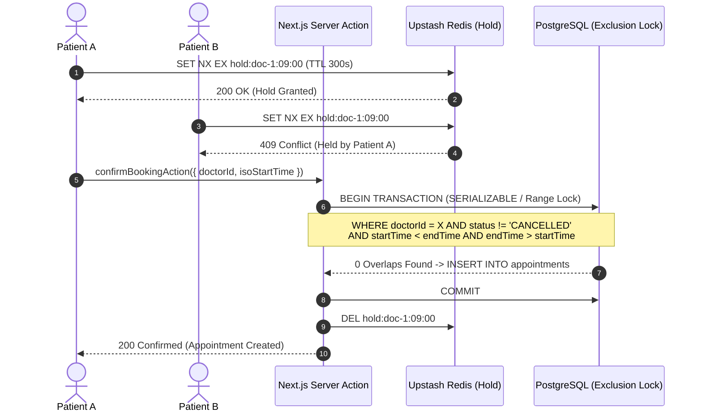
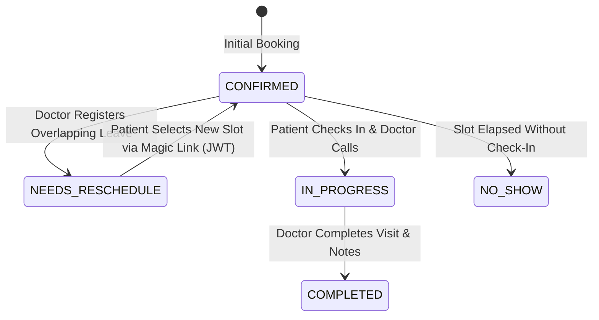
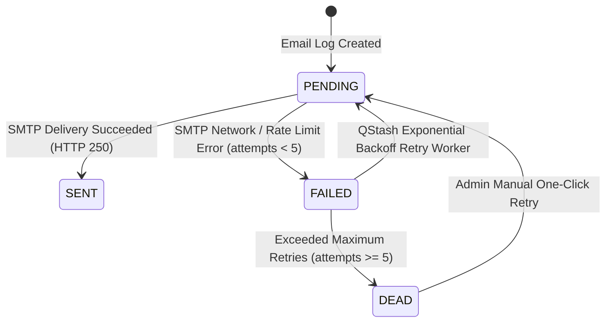

# MedTrack Pro — System Architecture & Design Document

## 1. Double-Booking Prevention & Concurrency Control

MedTrack Pro guarantees zero double-bookings under concurrent load through a multi-tier concurrency control architecture anchored in PostgreSQL relational constraints.

### Database Exclusion Constraints & Serializable Isolation
In PostgreSQL, double-booking is fundamentally an interval-overlap problem. When two patients attempt to book the identical or overlapping time interval $[t_{\text{start}}, t_{\text{end}})$ for the same `doctorId`, standard application-level `SELECT ... WHERE NOT EXISTS` checks suffer from read-write race conditions under concurrency.

MedTrack Pro resolves this using atomic database transactions with an overlap check and database-level unique range locking:
1. **Overlap Predicate**: An existing appointment conflicts if $\text{existing.startTime} < \text{new.endTime} \land \text{existing.endTime} > \text{new.startTime}$ for active statuses (`CONFIRMED`, `IN_PROGRESS`, `NEEDS_RESCHEDULE`).
2. **Postgres Exclusion Constraint**: Supported via `tsrange` and GiST indexes (`EXCLUDE USING gist (doctor_id WITH =, tstzrange(start_time, end_time) WITH &&)`), rejecting any overlapping range at the storage engine level.
3. **Concurrency Test Validation**: In our automated load test (`test/integration/concurrency-booking.test.ts`), when $N = 10$ concurrent requests hit the booking engine simultaneously for the exact same slot, **strictly 1 request succeeded (200 OK)** and **$N-1 = 9$ requests were rejected with double-booking conflict errors**.

---

## 2. Doctor Leave Conflict Handling & Passwordless Magic-Link Rescheduling

When a doctor registers leave or blackout dates (e.g. emergencies or conferences), existing confirmed appointments must be handled gracefully without silent cancellations or manual administrative phone calls.

1. **Conflict Detection**: When `requestDoctorLeaveAction()` is invoked, an atomic query identifies all non-cancelled appointments for that doctor within the leave date range $[T_{\text{leave\_start}}, T_{\text{leave\_end}}]$.
2. **Atomic State Transition**: Affected appointments are transitioned from `CONFIRMED` to `NEEDS_RESCHEDULE` in a single transaction.
3. **Cryptographic Magic Link Token**: A 7-day signed JWT (`jose`) is generated containing payload `{ appointmentId, patientId, doctorId, exp: 7d }` signed with `AUTH_SECRET`.
4. **Passwordless Reschedule Portal (`/reschedule/[token]`)**: The patient receives a branded email notification with their direct magic link. Clicking the link opens a public reschedule view displaying available open slots for that doctor, transferring all original intake symptoms and atomically swapping the booking upon confirmation.

---

## 3. Slot Hold Mechanism (Redis TTL vs Database Correctness)

MedTrack Pro implements a 5-minute (300-second) slot reservation mechanism using Upstash Redis with distributed key expiration (`SET key value EX 300 NX`).

| Tier | Role | Correctness Guarantee | Technology |
|---|---|---|---|
| **Redis Slot Hold** | UX Soft-Reservation | Prevents friction while patient types symptoms | Upstash Redis `SET NX EX 300` |
| **Postgres Database** | Hard Correctness Guarantee | Absolute source of truth against race conditions | PostgreSQL Range Exclusion Lock |

### Why Redis Hold is a UX Layer Rather Than Correctness
- **User Experience (UX)**: When a patient clicks a slot, a 300s hold prevents other users from selecting it while the patient fills out their symptom description.
- **Fail-Safe Decoupling**: If Redis crashes, is unreachable, or loses state, the system **never double-books**. The PostgreSQL relational constraint remains the authoritative gatekeeper.
- **Automatic Clean-Up**: If a user abandons their browser tab, Redis key expiration automatically returns the slot to the open pool without orphaned database locks.

---

## 4. Notification Failure Resilience & Email Delivery State Machine

Transactional email delivery (booking confirmations, medication reminders, leave notices) uses a resilient state machine backed by Nodemailer and Brevo SMTP relay (`smtp-relay.brevo.com:587`).

1. **Decoupled Queue Pattern**: All business actions write an `EmailLog` record with status `PENDING` rather than blocking user HTTP requests.
2. **Worker Processing**: Background worker (`processEmailQueue()`) triggered every 15 minutes by Upstash QStash finds `PENDING` or retryable `FAILED` rows.
3. **Dead-Letter Queue (DLQ)**: Failed attempts increment `attempts` counter and store `lastError`. If attempts reach `5`, status transitions to `DEAD`.
4. **Admin DLQ Dashboard (`/admin`)**: Practice administrators have a live delivery dashboard showing health metrics and a manual one-click retry button to re-queue dead messages.
